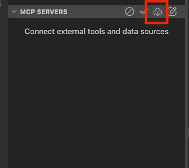
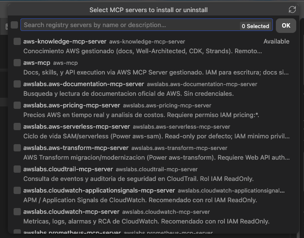
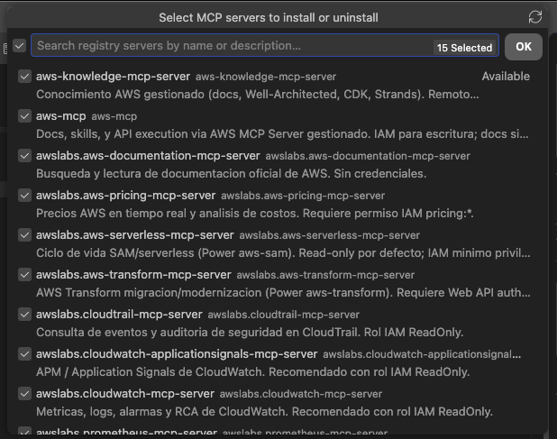
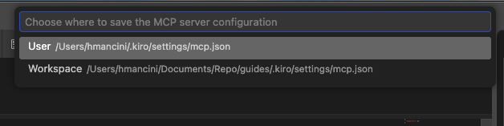
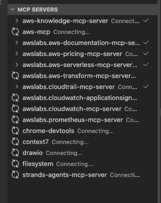

# Manual de gobierno de MCP en Kiro

> Guía de implementación. Cubre el modelo cliente/server, qué controla el MCP
> Registry, cómo publicarlo y cargarlo en un Kiro Profile, y cómo configura su cliente
> cada desarrollador.

Archivos que acompañan a este manual, en el mismo directorio: `mcp-registry.json`
(lista de referencia) y `mcp-client-config.json` (plantilla del cliente).

### Documentación oficial

| Tema | Enlace |
|---|---|
| Gobierno de MCP en Kiro | https://kiro.dev/docs/enterprise/governance/mcp/ |
| MCP Registry (Kiro IDE) | https://kiro.dev/docs/mcp/registry/ |
| Configuración de MCP en Kiro | https://kiro.dev/docs/mcp/configuration/ |
| Anuncio de la funcionalidad | https://kiro.dev/blog/enterprise-governance-mcp-and-models/ |
| Esquema completo del registry | https://docs.aws.amazon.com/amazonq/latest/qdeveloper-ug/mcp-governance.html |
| Estándar MCP Registry (versionado) | https://modelcontextprotocol.io/registry/versioning |
| Agent Toolkit for AWS | https://docs.aws.amazon.com/agent-toolkit/latest/userguide/ |
| MCP servers de AWS (awslabs) | https://github.com/awslabs/mcp |
| MCP servers de referencia | https://github.com/modelcontextprotocol/servers |
| Catálogo de Powers de Kiro | https://github.com/kirodotdev/powers/tree/main |

---

## 1. Modelo cliente / server (leer primero)

MCP (Model Context Protocol) es el "idioma" con el que un programa de IA se conecta
a proveedores de herramientas. Hay dos roles:

- **Cliente (MCP client / host):** es **Kiro** corriendo en la máquina del
  desarrollador (IDE, CLI, etc.). Kiro *consume* las herramientas. El "cliente" no
  es una persona: es la app Kiro instalada en el laptop.
- **Server (MCP server):** proveedor de herramientas. Le ofrece a Kiro un menú de
  *tools* (buscar documentación, listar buckets, leer un repo…) y las ejecuta.

El modelo de IA nunca toca AWS ni el disco directamente: le pide al server, y el
server realiza la acción.

### Los dos tipos de server

| Tipo | ¿Quién lo ejecuta? | Cómo | En el registry |
|---|---|---|---|
| **Local (stdio)** | **Kiro lo lanza** como proceso hijo en el laptop del dev | Corre `uvx`/`npx`/`docker` según el paquete; se comunican por stdin/stdout | bloque `packages` |
| **Remoto (HTTP/SSE)** | Ya corre en infra externa; **Kiro solo se conecta** | HTTPS a una URL | bloque `remotes` |

El `registryType` de un server local le dice a Kiro qué lanzador usar:
`npm` → `npx`, `pypi` → `uvx`, `oci` → `docker`. **Esos lanzadores deben estar
preinstalados** en la máquina del desarrollador. El dev no arranca nada a mano:
Kiro lo hace automáticamente cuando el server está permitido.

---

## 2. Qué es el MCP Registry y el Kiro Profile

- **MCP Registry (en gobierno de Kiro):** un **archivo JSON** que publicás y que
  contiene la **lista blanca (allow-list)** de MCP servers autorizados. Su formato
  es un subconjunto del estándar *MCP registry standard v0.1*. No es un servicio que
  se instale: es un archivo que se redacta, valida y sirve por HTTPS.
- **Kiro Profile:** la abstracción de gestión que define y aplica los ajustes
  administrativos a los usuarios enterprise en **una cuenta AWS + una región**
  (una sola por cuenta/región). Se administra desde la **Kiro console**.
- Los profiles pueden ser de **nivel organización** o de **nivel cuenta**, y **el de
  cuenta prevalece** sobre el de organización. Patrón típico: denegar/limitar por
  defecto en la organización y habilitar con allow-list para cuentas concretas.

El Kiro Profile lleva dos atributos de gobierno de MCP: un **toggle MCP on/off** y
una **URL de MCP Registry**. Los clientes Kiro que autentican contra ese profile
descargan y **obligan** esa política.

**Alcance:** el gobierno de MCP aplica solo a usuarios que autentican con una
**identidad corporativa**: AWS IAM Identity Center, Okta o Microsoft Entra ID.
Usuarios con **Builder ID o login social NO quedan sujetos** a los controles de
organización. Habilitar la autenticación corporativa es prerrequisito del gobierno.

---

## 3. Qué controla el registry y qué no

El registry actúa a nivel de **server**, no de acción individual. Es útil tenerlo
claro desde el principio para no esperar de él algo que no hace.

| Nivel de control | ¿En el registry? | Quién puede cambiarlo |
|---|---|---|
| Autorizar o excluir un server entero | Sí | Solo el administrador |
| Fijar la versión que corre | Sí | Solo el administrador |
| Argumentos de arranque (`packageArguments`) | Sí, si el server expone el flag | Solo el administrador |
| Variables de entorno base | Sí | El developer puede sobrescribirlas |
| Habilitar tools individuales | No existe en el registry | El developer, desde su config |

De ahí salen dos consecuencias prácticas:

**Los argumentos son firmes, las variables de entorno no.** Los `packageArguments`
del registry son read-only para el developer, así que un límite puesto por argumento
se mantiene. Por ejemplo, `aws-serverless` opera en modo lectura mientras no reciba
`--allow-write`, y como el registry no lo incluye, el developer no puede activarlo. En
cambio las variables de entorno locales tienen precedencia sobre las del registry, así
que si un server acepta un modo restringido por variable, el developer podría
cambiarlo.

**El permiso efectivo sobre AWS lo define IAM.** El registry decide qué servers
existen; el rol IAM con el que corre cada developer decide qué puede hacer contra la
cuenta. Un rol de solo lectura bloquea cualquier escritura sin importar cómo esté
configurado el server. Las dos capas se complementan y conviene definirlas juntas.

El control por tool existe (`disabledTools`, `autoApprove`), pero vive en la config
local del cliente, no en el registry. Sirve para que un equipo acote su propio uso, no
para imponer política desde la organización.

---

## 4. Implementación paso a paso

### Opción A — Deshabilitar MCP por completo (más restrictivo)

1. Kiro console → **Settings**.
2. En **Shared settings**, toggle **Model Context Protocol (MCP)** en **Off**.

Efecto: el cliente suprime **todos** los servers (user-configured, legacy, registry,
session-injected). `/mcp` muestra `MCP has been disabled by your administrator`.

*Fail-closed:* si el cliente no puede alcanzar la API de gobierno, MCP queda
deshabilitado (`Failed to retrieve MCP settings — MCP disabled`). Suele ser
transitorio.

### Opción B — Publicar una allow-list (MCP Registry)

**Paso 1 — Redactar el JSON.** Allow-list pura: lo que está se permite; lo que se
omite se deniega. (Ver §5 para el formato y `mcp-registry.json` como base.)

**Paso 2 — Servir por HTTPS.** Sirve cualquier server web. **Requisito:** certificado
SSL válido de una CA de confianza (autofirmados no se soportan) y que la URL sea
alcanzable desde las máquinas de los usuarios, aunque puede ser privada a la red
corporativa.

Dos formas de hacerlo, según el momento en que estés:

**Opción rápida — URL raw de un repositorio Git público.** Es la vía más directa
para probar el gobierno o iterar sobre el registry mientras lo definís. Publicás el
JSON en un repo público y usás la URL raw:

```
https://raw.githubusercontent.com/<org>/<repo>/refs/heads/main/<ruta>/mcp-registry.json
```

Ventaja: cero infraestructura, y cada cambio queda versionado por Git. Limitación:
el repositorio debe ser **público**, así que solo aplica si el contenido del registry
no es sensible.

**Opción para producción — S3 + CloudFront.** Cuando el registry pasa a ser parte de
la operación, conviene servirlo desde infraestructura propia:

```
Bucket S3      : privado, sin acceso publico directo, versioning ON
CloudFront     : Origin Access Control (OAC) hacia el bucket
Certificado    : ACM sobre dominio corporativo
Ruta publicada : https://mcp-registry.tuempresa.com/registry.json
```

Así controlás el acceso por red, tenés versionado del objeto y un dominio propio.

> ⚠️ **En cualquiera de las dos formas, la URL tiene que devolver HTTP 200 sin
> autenticación interactiva.** El error más común es publicar el JSON en un
> repositorio **privado**: la URL raw devuelve 404 y el cliente no puede sincronizar.
> El síntoma es engañoso, porque los servers siguen funcionando un rato con la copia
> cacheada y recién al siguiente sync se apaga todo por *fail-closed*. Verificá con:
>
> ```bash
> curl -s -o /dev/null -w "HTTP %{http_code}\n" "<URL_DEL_REGISTRY>"
> ```

**Paso 3 — Cargar la URL en el Kiro Profile.**
1. Kiro console → **Settings**.
2. Asegurar **MCP** en **On**.
3. Campo **MCP Registry URL** → **Edit** → pegar la URL → **Save**.

La URL se cifra en tránsito y en reposo.

**Jerarquía org/cuenta:** para "denegar por defecto, permitir por excepción",
configurá el profile de organización restrictivo y creá profiles de **cuenta** con
MCP On + su registry para los equipos que lo necesiten (el de cuenta prevalece).

### Ciclo de sincronización (operativa)

Kiro descarga el registry **al arrancar y cada 24 h**. En cada sync:
- Si un server local instalado **ya no está** en el registry → Kiro lo **termina** e
  impide volver a agregarlo.
- Si el server local tiene **otra versión** que la del registry → Kiro lo **relanza
  con la versión del registry**.

Implicancia: **revocar = quitar del JSON** (se propaga en ≤24 h sin tocar máquinas);
pero un error se propaga igual de rápido → versioná el archivo y controlá cambios.

---

## 5. Formato del registry

La raíz es `{ "servers": [ { "server": {...} } ] }`. Cada `server` requiere `name`,
`description` y `version`, y lleva **o** `packages` (local) **o** `remotes` (remoto),
con una sola entrada.

| Campo | Regla |
|---|---|
| `name` | Patrón `^[a-zA-Z0-9._-]+$`, entre 3 y 200 caracteres, único en el archivo |
| `title` | Opcional, hasta 100 caracteres |
| `description` | Hasta 100 caracteres |
| `version` | Cualquier string sin rangos. `latest` es válido; `^1.2.3`, `~1.2.3`, `>=1.2.3` y `1.x` se rechazan |

**Server local (stdio):**

```json
{
  "server": {
    "name": "awslabs.aws-documentation-mcp-server",
    "title": "AWS Documentation",
    "description": "Busqueda y lectura de documentacion oficial de AWS.",
    "version": "latest",
    "packages": [
      {
        "registryType": "pypi",
        "identifier": "awslabs.aws-documentation-mcp-server",
        "transport": { "type": "stdio" },
        "environmentVariables": [
          { "name": "FASTMCP_LOG_LEVEL", "value": "ERROR" }
        ]
      }
    ]
  }
}
```

**Server remoto (HTTP):**

```json
{
  "server": {
    "name": "aws-knowledge-mcp-server",
    "title": "AWS Knowledge",
    "description": "Conocimiento AWS gestionado. Remoto, sin auth.",
    "version": "latest",
    "remotes": [
      { "type": "streamable-http", "url": "https://knowledge-mcp.global.api.aws" }
    ]
  }
}
```

> **Sobre `registryBaseUrl`:** es un campo opcional para apuntar a un registro de
> paquetes propio. En entradas `pypi` conviene **omitirlo**, como en el ejemplo de
> arriba. El valor `https://pypi.org` parece correcto pero es el sitio web, no el
> índice de paquetes PEP 503 (`https://pypi.org/simple/`), y si el cliente lo usa como
> índice el server no arranca. Para `npm` sí es válido declarar
> `https://registry.npmjs.org`.

**Qué puede ajustar el developer.** Los parámetros del registry son read-only, pero
sobre ellos puede agregar variables de entorno propias, headers HTTP en servers
remotos, timeout, alcance (global o workspace) y permisos de las tools. Las variables
de entorno y los headers que define el developer tienen precedencia sobre los del
registry, que es lo que permite inyectar credenciales personales (§8).

**Lanzadores requeridos en la máquina:** `npm` usa `npx`, `pypi` usa `uvx` y `oci`
usa `docker`.

---

## 6. Powers y su relación con el registry

Un **Power** es un plugin (estándar *Agent Plugins*) que empaqueta skills +
conocimiento + **opcionalmente un MCP server** (`mcp.json`). Se instala con un clic y
carga sus tools MCP dinámicamente, solo cuando aparecen keywords relevantes.

**Punto de compatibilidad:** el gobierno de MCP suprime todos los servers que no
estén en la allow-list, **incluidos los que un Power inyecta**. Para que un Power
funcione bajo gobierno, el MCP server que trae adentro debe estar en el registry.

Regla operativa: por cada Power aprobado, revisar su `mcp.json`, extraer los servers
que declara y agregarlos al registry.

El catálogo completo de Powers, con el `mcp.json` de cada uno, está en:
**https://github.com/kirodotdev/powers/tree/main**

Mapeo de los Powers de uso más frecuente:

| Power | MCP servers que declara |
|---|---|
| aws-sam | `awslabs.aws-serverless-mcp-server`, `mcp-server-fetch` |
| aws-observability | `awslabs.cloudwatch-mcp-server`, `awslabs.cloudwatch-applicationsignals-mcp-server`, `awslabs.cloudtrail-mcp-server`, `awslabs.prometheus-mcp-server`, `awslabs.aws-documentation-mcp-server` |
| cloud-architect | `awslabs.aws-pricing-mcp-server`, `https://knowledge-mcp.global.api.aws`, `awslabs.aws-api-mcp-server`, `@upstash/context7-mcp`, `mcp-server-fetch` |
| aws-transform-agent-toolkit | `awslabs.aws-transform-mcp-server` |
| Strands | `strands-agents-mcp-server` |

> **Nota:** la tabla lista lo que cada Power declara, no lo que nuestra allow-list
> incluye. `mcp-server-fetch` quedó afuera porque su release actual es incompatible
> con el SDK `mcp` (ver §8), y `awslabs.aws-api-mcp-server` quedó cubierto por
> `aws-mcp` del Agent Toolkit, cuyo `run_script` reemplaza a `call_aws`. Los Powers
> que dependan de esos dos funcionan con capacidades reducidas.

---

## 7. Agent Toolkit for AWS y su lugar en el registry

El **Agent Toolkit for AWS** es la oferta oficial de AWS para dar a los agentes
(Kiro, Claude Code, Cursor, Codex y cualquiera que hable MCP) herramientas,
conocimiento actualizado y guardrails. En nuestra allow-list aparece como `aws-mcp`
y es la entrada recomendada para trabajar con AWS.

Documentación: https://docs.aws.amazon.com/agent-toolkit/latest/userguide/

**Componentes:**
- **AWS MCP Server** — server gestionado por AWS con un endpoint único. La búsqueda
  de documentación y el descubrimiento de skills funcionan **sin credenciales**; la
  ejecución de acciones usa tus credenciales IAM.
- **Agent skills** — procedimientos curados que el agente carga bajo demanda, solo
  cuando son relevantes para la tarea.
- **Plugins** — paquetes de instalación para Claude Code y Codex. Kiro no los
  necesita: se conecta directo al server.
- **Rules files** — configuración a nivel proyecto para fijar preferencias de cómo
  el agente trabaja con AWS.

**Tools que expone** (referencia:
https://docs.aws.amazon.com/agent-toolkit/latest/userguide/understanding-mcp-server-tools.html):

| Tool | Para qué | Credenciales |
|---|---|---|
| `aws___search_documentation` | Busca en toda la documentación de AWS, incluidas las skills | No requiere |
| `aws___read_documentation` | Trae una página de documentación en markdown | No requiere |
| `aws___retrieve_skill` | Recupera un procedimiento curado para un dominio | No requiere |
| `aws___list_regions` | Lista regiones con sus identificadores | No requiere |
| `aws___get_regional_availability` | Disponibilidad regional de servicios y features | No requiere |
| `aws___run_script` | Ejecuta Python con acceso a las APIs de AWS en un sandbox | IAM |
| `aws___get_presigned_url` | Genera URLs pre-firmadas de S3 | IAM |
| `aws___get_tasks` | Consulta el estado de operaciones largas | IAM |

**Por qué encaja bien en un esquema gobernado:**
- Autentica con los **roles IAM** que ya tenés, por SigV4 o OAuth 2.1.
- **CloudTrail** registra todas las llamadas y **CloudWatch** aporta métricas de uso.
- Agrega automáticamente los *condition keys* `aws:ViaAWSMCPService` y
  `aws:CalledViaAWSMCP`, así que en IAM podés distinguir lo que se originó vía MCP y
  aplicarle políticas propias.
- Un solo endpoint reemplaza a varios servers sueltos, lo que simplifica la
  allow-list y el mantenimiento.
- Soporta **múltiples perfiles AWS** en una misma sesión, útil para trabajar entre
  cuentas sin reiniciar el server. Ver:
  https://docs.aws.amazon.com/agent-toolkit/latest/userguide/multi-account-access.html

**Cómo combinarlo con el resto de la allow-list:**
- `aws-mcp` cubre documentación, skills y ejecución de APIs de AWS. Es el punto de
  entrada por defecto para tareas de AWS.
- Los servers de **awslabs** que quedan en la lista aportan tools especializados que
  el toolkit no reemplaza: CloudWatch tiene análisis de causa raíz, Prometheus usa
  PromQL, `aws-serverless` maneja el ciclo de vida de SAM, `aws-transform` cubre
  migración.
- Los servers **no-AWS** (diagramas, documentación de librerías, filesystem) cubren
  todo lo demás.

Modelo de dos capas para tener presente: **registry + Kiro Profile definen qué
servers pueden existir; IAM y CloudTrail definen qué pueden hacer contra AWS y cómo
queda auditado.**

---

## 8. Configurar el cliente Kiro

Una vez que el administrador publicó el registry y cargó la URL en el Kiro Profile,
el developer necesita configurar su cliente. Esta sección explica cómo.

### Prerequisitos en la máquina del developer

| Lanzador | Instalar si no lo tenés | Para qué servers |
|---|---|---|
| `uvx` (viene con `uv`) | `brew install uv` o [guía oficial](https://docs.astral.sh/uv/getting-started/installation/) | Todos los `registryType: "pypi"` |
| `npx` (viene con Node.js) | `brew install node` o [nodejs.org](https://nodejs.org/) | Todos los `registryType: "npm"` |
| `docker` (opcional) | [docker.com](https://www.docker.com/products/docker-desktop/) | Solo si hay `registryType: "oci"` |

### Dónde vive la configuración

El archivo del cliente es `.kiro/settings/mcp.json`. Existe en dos alcances:

| Alcance | Ruta | Cuándo usarlo |
|---|---|---|
| **User** (global) | `~/.kiro/settings/mcp.json` | Servers que querés en todos tus proyectos |
| **Workspace** | `<proyecto>/.kiro/settings/mcp.json` | Servers específicos de un proyecto |

### Cómo se ve una entrada

Con el registry activo, cada entrada solo necesita el nombre del server y una
referencia al registry:

```json
{
  "awslabs.aws-documentation-mcp-server": {
    "type": "registry",
    "disabled": false
  }
}
```

`"type": "registry"` le dice a Kiro que traiga la definición completa desde el
registry: el paquete, la versión, los argumentos y las variables de entorno base. El
developer no necesita conocer esos detalles ni mantenerlos, y aplica igual para
servers locales (`pypi`, `npm`) y remotos.

La key del JSON debe coincidir **exactamente** con el `name` del server en el
registry. Si no coincide, el gobierno lo trata como un server no autorizado y lo
suprime.

Sobre esa base se pueden agregar los ajustes personales que el registry no define
(credenciales, timeout, tools excluidos), como se explica más abajo.

---

### Dos formas de activar los servers

Kiro ofrece dos caminos para el mismo resultado. Conviene conocer los dos: el visual
sirve para explorar qué hay disponible, y el archivo sirve para estandarizar un equipo.

| | Vía visual | Vía archivo |
|---|---|---|
| Cómo | Panel MCP Servers de Kiro | Editar `mcp.json` a mano |
| Ventaja | Ves el catálogo con descripciones, sin escribir JSON | Reproducible: se comparte el archivo y todos quedan igual |
| Ideal para | Explorar, arrancar, activar algo puntual | Onboarding de equipo, versionar la config en el repo |

#### Vía visual — desde el panel de Kiro

**Paso 1.** Abrí el panel **MCP SERVERS** y hacé clic en el ícono de instalar
(el de la nube con la flecha).



**Paso 2.** Kiro abre el selector con **los servers del registry, y solo esos**. Cada
entrada muestra el nombre, el identificador y la descripción que definió el
administrador. Los que todavía no instalaste aparecen como *Available*.



**Paso 3.** Marcá los que querés. Podés usar el buscador para filtrar, o el checkbox
de la izquierda de la barra de búsqueda para seleccionar todos. El contador de la
derecha muestra cuántos llevás. Cuando termines, **OK**.



**Paso 4.** Kiro pregunta dónde guardar la configuración: **User** (global, aplica a
todos tus proyectos) o **Workspace** (solo este proyecto).



**Paso 5.** Kiro escribe el `mcp.json` correspondiente y arranca los servers. En el
panel los vas viendo pasar a *Connecting...* y luego a *Connected* con un check verde.
La primera vez tarda más, porque `uvx` y `npx` descargan los paquetes.



Si alguno queda en *Connection Failed*, revisá la sección de diagnóstico de más abajo;
la causa más común es una variable de entorno sin definir.

#### Vía archivo — con la plantilla

Copiá el contenido de `mcp-client-config.json` en tu `.kiro/settings/mcp.json` y
guardá. Kiro detecta el cambio y levanta los servers, sin pasar por el selector.

Esta es la vía recomendada para un equipo: el archivo se versiona en el repositorio
del proyecto y todos arrancan con la misma configuración, incluidos los ajustes de
`disabled`, `disabledTools` y `timeout` que ya vengan definidos.

Las dos vías escriben el mismo archivo, así que se pueden combinar: activar por el
panel para probar, y después copiar el resultado a la plantilla del equipo.

### Credenciales: el patrón placeholder + variable de entorno

Este es el punto que más confusión genera, así que vale explicarlo completo.

**El problema:** el registry es **uno solo para toda la organización**, pero cada
developer tiene un **perfil IAM distinto** (`hmancini+genia-admin`, `juan-readonly`,
etc.). No podés hardcodear un perfil en el registry.

**La solución:** el registry declara un **placeholder** `${VAR}` y cada developer
define esa variable en **su** shell. Kiro la expande al lanzar el server.

```
Registry (admin, compartido)          Shell del developer (personal)
─────────────────────────────         ──────────────────────────────
"environmentVariables": [        →    export AWS_PROFILE=mi-perfil
  { "name": "AWS_PROFILE",
    "value": "${AWS_PROFILE}" }       Kiro lanza el server con
]                                     AWS_PROFILE=mi-perfil
```

Así el registry queda **agnóstico del usuario** y cada uno usa sus credenciales sin
tocar el JSON compartido.

**Configuración del developer:**

```bash
# Definir el perfil (usar uno de los que tengas en ~/.aws/config)
export AWS_PROFILE=mi-perfil-readonly

# Para que persista entre sesiones
echo 'export AWS_PROFILE=mi-perfil-readonly' >> ~/.zshrc
```

> ⚠️ **Reiniciá Kiro después de definir la variable.** Kiro hereda el entorno del
> proceso que lo lanzó; si exportás la variable en una terminal con Kiro ya abierto,
> el IDE no la ve.

**Cómo verificar que está definida:**

```bash
echo "AWS_PROFILE=[${AWS_PROFILE}]"    # debe mostrar el nombre, no [] vacío
aws configure list-profiles            # perfiles disponibles
```

#### Por qué algunos servers fallan y otros no cuando falta la credencial

No todos los servers reaccionan igual a un `AWS_PROFILE` ausente o vacío. Hay dos
comportamientos:

| Comportamiento | Servers | Sin `AWS_PROFILE` |
|---|---|---|
| **Validación al arranque** — crean la sesión boto3 durante el init | `aws-mcp`, `cloudwatch`, `cloudwatch-applicationsignals`, `prometheus`, `aws-serverless`, `aws-transform` | ❌ El proceso muere → `Connection closed` |
| **Carga diferida** — resuelven credenciales en la primera llamada | `aws-documentation`, `aws-pricing`, `cloudtrail` | ✅ Conecta; falla recién al usar un tool |

**Síntoma típico del problema:** el panel MCP muestra `Connection Failed` con
`MCP error -32000: Connection closed` en los servers de la primera fila, mientras
los de la segunda conectan sin problema. Si ves ese patrón, lo primero a revisar es
si `AWS_PROFILE` está definido y **no vacío**.

La causa técnica: cuando el placeholder no expande, el server recibe
`AWS_PROFILE=""` (string vacío) y boto3 falla al inicializar la sesión con un perfil
sin nombre. El proceso termina antes de completar el handshake MCP, y Kiro lo
reporta como conexión cerrada.

#### Otros placeholders del mismo patrón

| Placeholder | Para qué | Cómo lo define el developer |
|---|---|---|
| `${AWS_PROFILE}` | Perfil IAM de los servers AWS | `export AWS_PROFILE=mi-perfil` |
| `${ALLOWED_PATH}` | Directorio permitido de `filesystem` | `export ALLOWED_PATH=/Users/yo/proyectos` |

Regla general: **todo lo que sea específico del developer va como placeholder en el
registry y como variable de entorno en su máquina.** El registry solo lleva valores
compartidos (región de la org, nivel de log, flags de seguridad).

### Controles opcionales del developer

| Control | Dónde | Ejemplo |
|---|---|---|
| Deshabilitar un server | `"disabled": true` | Server que solo se usa ocasionalmente y se habilita bajo demanda |
| Excluir tools puntuales | `"disabledTools": [...]` | `["delete_workspace", "delete_job"]` en `aws-transform` |
| Auto-aprobar tools de lectura | `"autoApprove": [...]` | `["search_documentation", "read_documentation"]` |
| Timeout extendido | `"timeout": 100000` | Para servers que arrancan más lento, como `aws-mcp` |

### Verificar la conexión

1. Abrí el panel **MCP Servers** en Kiro (icono en la barra lateral).
2. Cada server debería mostrar **Connected** (✔) o **Connection Failed** (✖).
3. Para más detalle: Command Palette → `Kiro: Show MCP Logs`.
4. Test rápido: preguntale a Kiro *"¿Qué regiones de AWS hay disponibles?"* — si
   responde usando `aws-mcp` o `aws-knowledge-mcp-server`, la conexión funciona.

### Diagnóstico de `Connection closed`

Si un server local muestra `MCP error -32000: Connection closed`, significa que el
proceso arrancó y **murió antes de completar el handshake**. Revisá en este orden:

| # | Revisar | Cómo |
|---|---|---|
| 1 | ¿El lanzador está instalado? | `which uvx` / `which npx` |
| 2 | ¿La variable de entorno está definida y no vacía? | `echo "[${AWS_PROFILE}]"` |
| 3 | ¿El server arranca a mano? | Ver comando abajo |
| 4 | ¿El paquete es compatible con su SDK? | El traceback lo dice (`ImportError` / `AttributeError`) |

Para probar un server local fuera de Kiro y ver el error real:

```bash
echo '{"jsonrpc":"2.0","id":1,"method":"initialize","params":{"protocolVersion":"2024-11-05","capabilities":{},"clientInfo":{"name":"t","version":"1"}}}' \
  | AWS_PROFILE=mi-perfil uvx <identifier-del-registry>
```

Si devuelve un JSON con `"result"` y `serverInfo`, el server está sano y el problema
es de configuración. Si devuelve un traceback de Python, el problema está en el
paquete o en sus dependencias.

Si todos los servers `pypi` fallan a la vez, revisá el `registryBaseUrl` de esas
entradas en el registry: es la causa más común y está explicada en §5.

---

## 9. Set de referencia

La allow-list de arranque está en `mcp-registry.json` y trae 15 servers ya validados,
agrupados por lo que aportan:

**Punto de entrada a AWS**
- `aws-mcp` — Agent Toolkit: documentación, skills y ejecución de APIs en un solo
  endpoint (§7).

**Documentación y conocimiento**
- `awslabs.aws-documentation-mcp-server` — documentación de AWS, sin credenciales.
- `aws-knowledge-mcp-server` — conocimiento AWS gestionado, remoto y sin auth.
- `context7` — documentación actualizada de librerías y frameworks.
- `strands-agents-mcp-server` — documentación del framework Strands Agents.

**Observabilidad y costos**
- `awslabs.cloudwatch-mcp-server` — métricas, logs, alarmas y análisis de causa raíz.
- `awslabs.cloudwatch-applicationsignals-mcp-server` — APM / Application Signals.
- `awslabs.cloudtrail-mcp-server` — eventos y auditoría de CloudTrail.
- `awslabs.prometheus-mcp-server` — consultas PromQL sobre Amazon Managed Prometheus.
- `awslabs.aws-pricing-mcp-server` — precios y análisis de costos.

**Desarrollo y despliegue**
- `awslabs.aws-serverless-mcp-server` — ciclo de vida de SAM y aplicaciones
  serverless.
- `awslabs.aws-transform-mcp-server` — migración y modernización.

**Propósito general**
- `drawio` — genera y edita diagramas; los datos no salen de la máquina.
- `filesystem` — operaciones de archivo acotadas al directorio de `${ALLOWED_PATH}`.
- `chrome-devtools` — inspección y automatización de un Chrome vivo, para QA.

### Cómo ajustar la lista

Cada organización decide qué servers autoriza. Al evaluar uno, conviene mirar tres
cosas: quién lo mantiene (oficial de AWS, del proyecto MCP, o de la comunidad), si
expone operaciones de escritura y con qué credenciales opera. Con eso definís si va
a la lista y con qué rol IAM.

Dos recomendaciones prácticas:

**Validá que arranca antes de publicarlo.** Usá el procedimiento de §8
(Diagnóstico). Los paquetes de la comunidad a veces quedan desactualizados respecto
del SDK `mcp` y dejan de funcionar; no tiene sentido publicar en el registry algo que
no puede conectar.

**Ajustá los placeholders antes de producción.** `filesystem` necesita que cada
desarrollador defina `${ALLOWED_PATH}`, y los servers de AWS necesitan
`${AWS_PROFILE}` (§8).

### Estrategia de versión

Todos los servers usan `"version": "latest"`, lo que elimina el mantenimiento del
JSON: Kiro relanza siempre con la última release publicada.

El trade-off es que se adoptan releases nuevas sin revisión previa. Para este set es
aceptable porque son paquetes oficiales. Si algún server pasa a ser crítico para la
operación, se le puede fijar la versión exacta como excepción.

---

## Anexo — Para tener presente

- El registry se descarga al arrancar Kiro y se refresca cada 24 h.
- Revocar un server es quitarlo del JSON; se propaga en el siguiente sync sin tocar
  las máquinas de los developers.
- Si el cliente no alcanza la API de gobierno, MCP queda deshabilitado (*fail-closed*).
- El gobierno se aplica del lado del cliente y se complementa con IAM, que define el
  permiso efectivo sobre AWS.
- Los usuarios con Builder ID o login social no quedan alcanzados por el gobierno de
  la organización.
